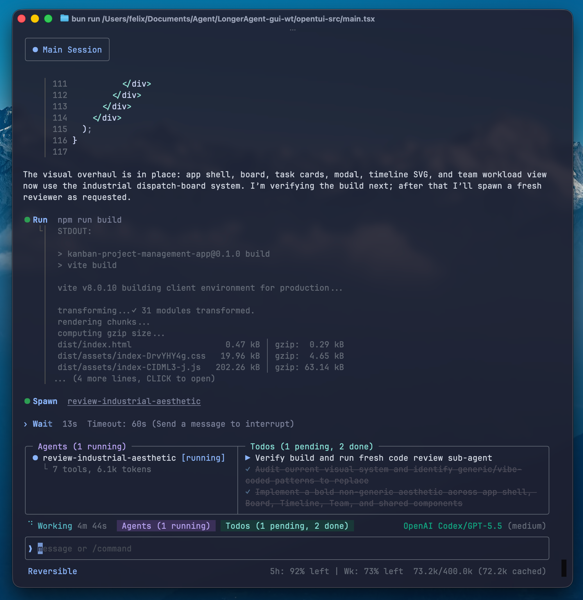
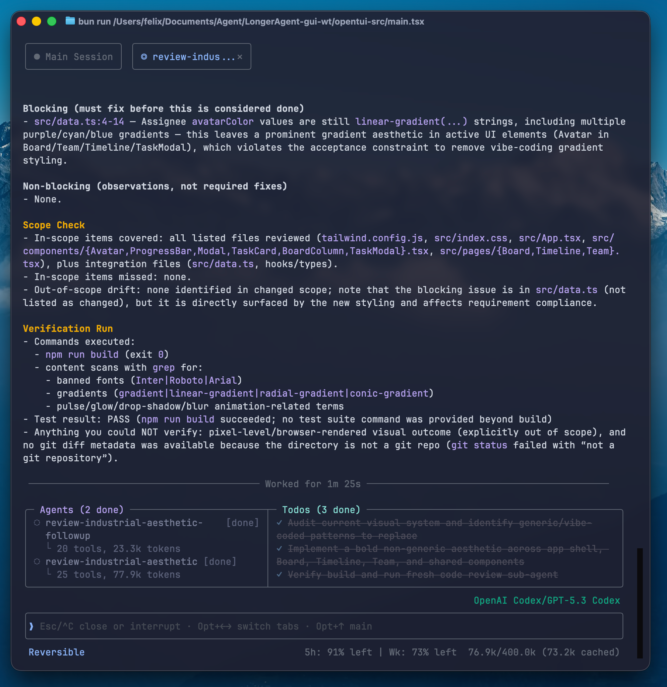

# Fermi

<p align="center">
  <strong>The coding agent that manages its own contexts.</strong>
</p>
<p align="center">
  Terminal UI built on <a href="https://github.com/anomalyco/opentui">OpenTUI</a>.
</p>
<p align="center">
  English | <a href="./README.zh-CN.md">中文</a>
</p>
<p align="center">
  <a href="https://github.com/FelixRuiGao/Fermi/releases/latest"></a>
  <a href="https://felixruigao.github.io/Fermi/"></a>
  <a href="https://github.com/anomalyco/opentui"></a>
  <a href="./LICENSE"></a>
</p>



Fermi is a terminal AI coding agent designed for multi-hour sessions. The agent inspects its own context window, decides what is still valuable, and surgically compresses the rest — down to a single tool call result. Sessions run for hours; decisions, file paths, and unresolved issues stay intact.

> **Platform:** macOS (Apple Silicon). **License:** MIT.

## Install

```bash
curl -fsSL https://raw.githubusercontent.com/FelixRuiGao/Fermi/main/scripts/install.sh | sh
```

Single binary, no runtime required. The installer puts `fermi` in `~/.fermi/bin/` and adds it to your PATH. Open a new terminal (or `source ~/.zshrc`), then:

```bash
fermi init   # setup wizard — pick providers, models, API keys
fermi        # start a session
```

Updates: `fermi update` (manual) or `/autoupdate` to toggle background checks.

## Context Management

The core feature. The agent has two tools for inspecting and compressing its own context:

| Tool | What it does |
|------|-------------|
| `show_context` | Display a context map — all groups with token sizes, types, and inline annotations |
| `summarize` | Compress selected context groups — extract decisions and facts, discard the rest |

The user can also intervene directly:

| Command | What it does |
|---------|-------------|
| `/summarize` | Interactive range picker — select turns, provide a focus prompt |
| `/compact` | Full context reset with continuation summary |

Three layers prevent context from ever silently overflowing:

```
Context usage ━━━━━━━━━━━━━━━━━━━━━━━━━━━━━━━━━━━━━━━━━━━ 100%
               ▲ 60%            ▲ 80%       ▲ 85%    ▲ 90%
               hint L1          hint L2     compact   compact
               (nudge)          (urgent)   (before    (mid-
                                            turn)     turn)
```

[Full context management guide →](https://felixruigao.github.io/Fermi/guide/context)

## Rich Terminal UI

Every detail is accessible without leaving the terminal. Tool results, file diffs, and bash output are shown inline with smart truncation — click any entry to expand the full content in a dedicated detail view. Sub-agents get their own conversation tabs; click an agent name or use `Opt+←/→` to switch between them.



- **Syntax-highlighted diffs** — file edits shown as red/green hunks with context lines; writes render with line numbers
- **Clickable file paths** — hover highlights, click opens in your editor
- **Live status bar** — agent count, plan progress, model name, permission mode, context usage with token counts
- **Tool grouping** — consecutive reads/searches collapse into a summary like "Explored (Read ×3, Search ×2)"

## Sub-Agents

The agent spawns parallel workers with their own context windows:

```
spawn(id="auth-check", template="explorer", mode="oneshot", model_level="low", task="...")
```

- **Templates:** `explorer` (read-only), `executor` (task-focused), `reviewer` (verification)
- **Model tiers:** Assign high/medium/low models via `/tier` — save cost on simple tasks
- **Modes:** `oneshot` (run once, return result) or `persistent` (stays alive, receives messages)

## Session Control

- **Async messaging** — type while the agent works. Messages queue and deliver when the agent pauses between actions.
- **Rewind** — `/rewind` rolls back to any previous turn, reverting conversation **and** file changes.
- **Fork** — `/fork` branches the current session into a new direction.
- **Persistent memory** — `AGENTS.md` files (global + project) survive compact and session restarts.

---

## Providers

Anthropic · OpenAI · GitHub Copilot · DeepSeek · Kimi · MiniMax · GLM · Xiaomi · OpenRouter · Ollama · oMLX · LM Studio

Cloud or local, your choice. Switch at runtime with `/model`. `fermi init` handles setup.

[Provider setup guide →](https://felixruigao.github.io/Fermi/providers/)

## Key Commands

`/model` switch model · `/summarize` compress context · `/compact` full reset · `/rewind` undo turns + files · `/permission` safety mode · `/tier` sub-agent models · `/session` resume · `/fork` branch session · `/skills` manage skills · `/mcp` MCP tools

[Full command reference →](https://felixruigao.github.io/Fermi/guide/commands)

## Limitations

- **macOS + Apple Silicon only** — no Windows or Linux support
- **No sandbox** — shell commands and file edits execute directly (use `/permission` to control)
- **Third-party coding plans** (Kimi-Code, GLM-Code) use provider-side whitelists and may reject requests

Full documentation: **[felixruigao.github.io/Fermi](https://felixruigao.github.io/Fermi/)**

## Interfaces

- **Terminal (TUI)** — the primary interface, built on [OpenTUI](https://github.com/anomalyco/opentui). Run with `fermi` or `bun run dev`.
- **Desktop (GUI)** — an Electron app in early development (`gui/`). Same runtime, different frontend.

## Development

```bash
bun install         # Install dependencies
bun run dev         # Run the TUI (OpenTUI)
bun run build       # Build binary
bun test            # Run tests
bun run typecheck   # Type check
```

## License

[MIT](./LICENSE). The TUI uses [OpenTUI](https://github.com/anomalyco/opentui) (MIT).
